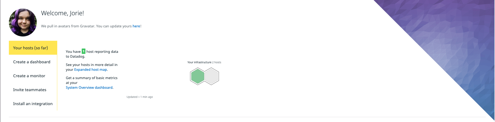
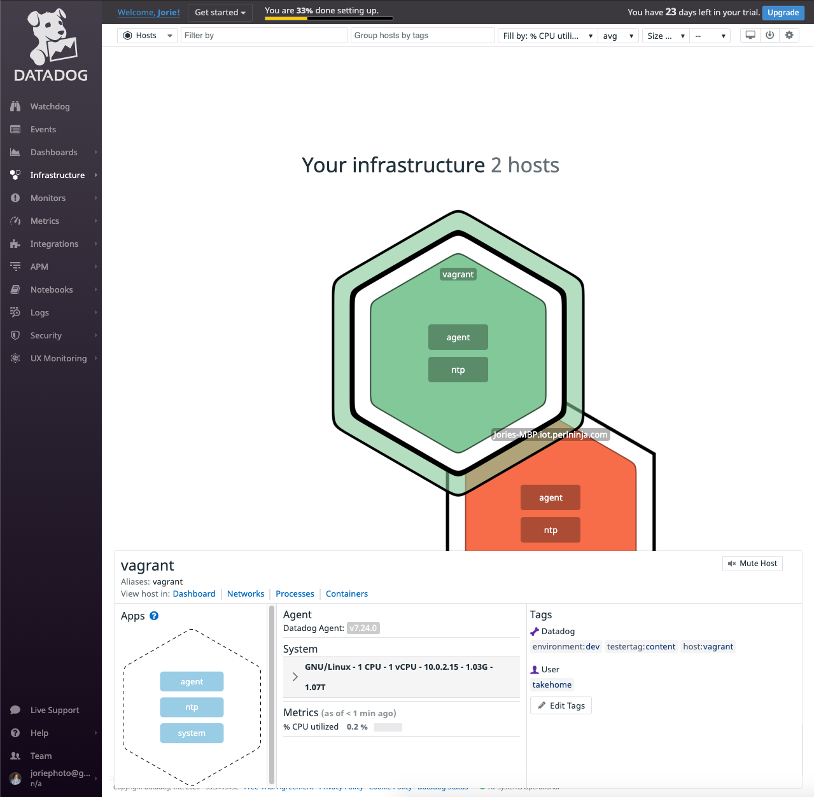
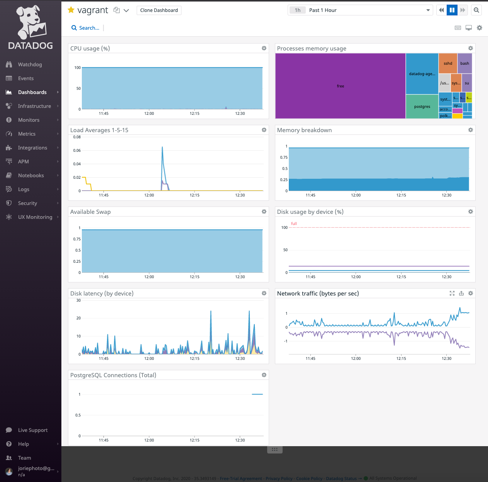
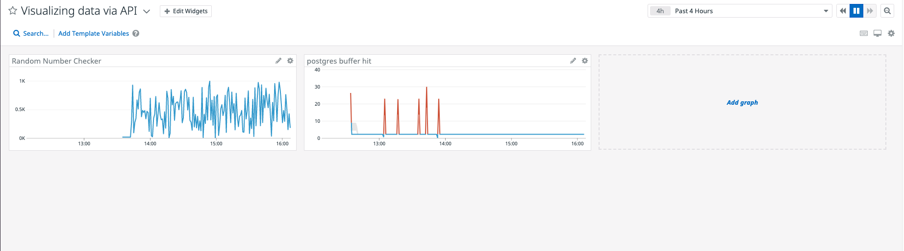
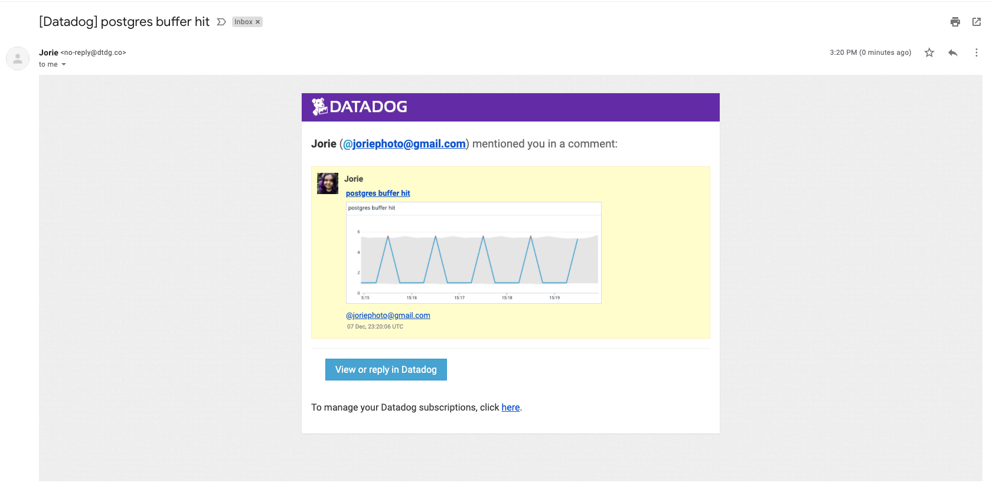
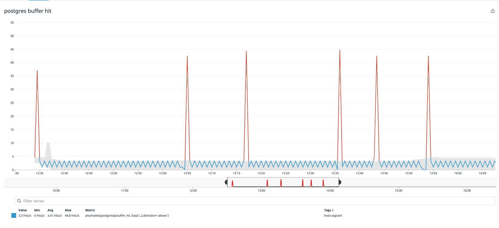
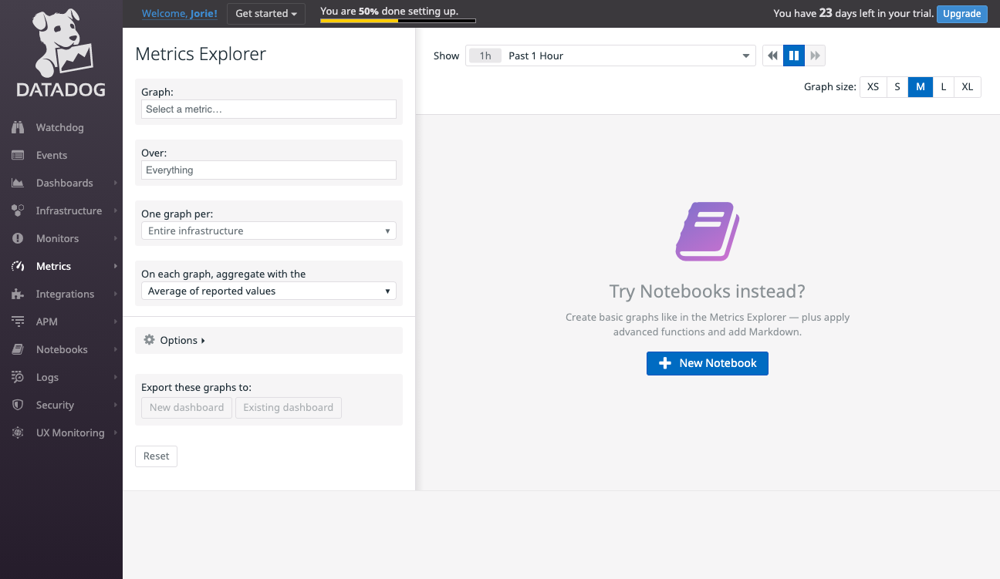

## Environment Setup

For my environment, I chose to install Ubuntu on a Vagrant vm. In screenshots including my Host Map, you'll see I also have an agent running locally on my MacBook Pro. I initially had some issues with tags not appearing in my datadog account, and decided to add an extra agent for troubleshooting and comparing hosts.



## Collecting Metrics

### Add tags in the Agent config file and show us a screenshot of your host and its tags on the Host Map page in Datadog.

I learned while reading the documentation that there are multiple ways to add tags, and I wanted to try at least two methods.

* On my vm, in `datadog.yaml` I uncommented the tags section, used the already included `environment` tag, and added another key:value pair, 'testertag:content'. This appeared in Tags under __Datadog__.
* Using the UI, I added a tag value without a key, named "takehome". This appeared in Tags under __User__.



One thing that took me an embarrassingly long time to realize was that in order for my tags in `datadog.yaml` to appear, I had to restart the agent after making changes to the file. I was searching for a much more complex answer to this problem and making it harder than it needed to be! For this reason though, I would've liked to see a note or some mention in the __Configuration file__ section of [Assigning Tags](https://docs.datadoghq.com/getting_started/tagging/assigning_tags/?tab=noncontainerizedenvironments#configuration-file) about restarting after adding new tags. It would have saved me a lot of time.

### Install a database on your machine (MongoDB, MySQL, or PostgreSQL) and then install the respective Datadog integration for that database.

I chose PostgreSQL. After the Datadog integration was configured, I was happy to see a new item in this vagrant dashboard, titled "PostgreSQL Connections (Total)":



### Create a custom Agent check that submits a metric named my_metric with a random value between 0 and 1000.

Using the documentation's example, I modified the 'Hello World' check to fit my needs. I created a file called `custom_agentcheck.py` and placed it inside `/etc/datadog-agent/checks.d`.

Here's what it contained:

```python
import random
# the following try/except block will make the custom check compatible with any Agent version
try:
    # first, try to import the base class from new versions of the Agent...
    from datadog_checks.base import AgentCheck
except ImportError:
    # ...if the above failed, the check is running in Agent version < 6.6.0
    from checks import AgentCheck

# content of the special variable __version__ will be shown in the Agent status page
__version__ = "1.0.0"

class CustomAgentCheck(AgentCheck):
    def check(self, instance):
        self.gauge('my_metric', random.randint(0,1000), tags=['check:random_num'])
```
### Change your check's collection interval so that it only submits the metric once every 45 seconds.

**Bonus Question** Can you change the collection interval without modifying the Python check file you created?

I created a file called `custom_agentcheck.yaml` and placed it inside  `/etc/datadog-agent/conf.d` with the following:

```yaml
init_config:

instances:
  - min_collection_interval: 45
```

As a side note, I'm wondering if in the past the answer to this "Bonus Question" wasn't included so prominently in the docs? The `min_collection_interval` is mentioned at the top of the page of [Writing a Custom Agent Check](https://docs.datadoghq.com/developers/write_agent_check/?tab=agentv6v7). Because I used this page as a reference, I knew this was the way to set it to 45 as I was setting this up from the beginning, and so doing it in the Python script wouldn't have been my first plan of attack. (Also if it's just meant to be an easy bonus, Thank You. :) ) 

## Visualizing Data

I felt like I was missing a fair amount of context about workflows for this step. The documentation defaults to display a Python generated example Dashboard, so I decided to go in that direction, even though I have not done a ton of Python. I modified the example to look like this:

```python
from datadog import initialize, api

options = {
    'api_key': '<KEY REDACTED>',
    'app_key': '<KEY REDACTED>'
}

initialize(**options)

title = 'Visualizing data via API'
widgets = [{
    'definition': {
        'type': 'timeseries',
        'requests': [
            {'q': 'avg:my_metric{host:vagrant}'}
        ],
        'title': 'Random Number Checker'
    }
},
{'definition': {
        'type': 'timeseries',
        'requests': [
        {

            'q': "anomalies(avg:postgresql.buffer_hit{host:vagrant}, 'basic', 2)",
        }
    ],
        'title': 'postgres buffer hit'
    }
    }]
layout_type = 'ordered'
description = 'A dashboard for the takehome.'
is_read_only = True
notify_list = ['<EMAIL REDACTED>']

api.Dashboard.create(title=title,
                     widgets=widgets,
                     layout_type=layout_type,
                     description=description,
                     is_read_only=is_read_only,
                     notify_list=notify_list)
```
After I made this little modified script, I didn't know where to put it or what to do to get it to "create" the dashboard.

After some sleuthing, I ended up installing `datadogpy` in my vagrant environment, put the script I created there, and ran it. It didn't return anything, which I assumed was good. Upon refreshing my dashboards in the UI, I was happy (and relieved) to see my new dashboard had been created!



### Take a snapshot of this graph and use the @ notation to send it to yourself.

I'll admit I couldn't figure out where this button was as quickly as I wanted, and I was too stubborn to go spelunking through documentation to learn about it, but I did eventually figure it out and received an email with the five minute graph snippet.



### Bonus Question: What is the Anomaly graph displaying?

I might not have chosen the most exciting/appropriate thing to track for my anomaly graph. At least, in a 5 minute timeframe, it doesn't show any real anomalies. If I scale back to the last 4 hours though, I do have some larger spikes. The anomaly graph displays "normal" or acceptable units in a gray band, and the points outside of that range displayed in red, seen here as spikes:



I didn't try it out as I didn't think my little test database was going to get any exciting loads, but I also noticed there is a notification system you could set to alert you if it stayed above or below the normal range for longer than five minutes, which is neat!

## Extra comments

I definitely interacted with the documentation and the product quite a lot during this process! Here are some of my notes:

* The link in the README file of the take home to "Writing an Agent check" on line 66 should be updated. It appears to be redirecting to not quite the same thing as what I'm guessing is intended, [Introduction to Agent-based integrations](https://docs.datadoghq.com/developers/integrations/). My guess is that this link *should* point to [Writing a Custom Check](https://docs.datadoghq.com/developers/write_agent_check/)
* I may just be missing context for workflows here, but I found myself from the Host Map clicking on "View host in: Dashboard" and when I tried finding that Dashboard from the "Dashboards" side navigation to begin with, I had to drill down to "All Hosts" to see it in that list, and even after starring that dashboard, I frequently doesn't appear in my starred items when hovering over the left nav "Dashboards".
* When you go to the Metrics Explorer, I think it's an odd choice to suggest to the user "Try Notebooks instead?" As a user, this makes me wonder if Metrics is soon going to be sunsetted or doesn't work easily, or any other number of assumptions.
    
* While researching and writing my blog post, I found a broken link in the product. On the [logs onboarding page](https://app.datadoghq.com/logs/onboarding), if you click ["Logs FAQ"](https://app.datadoghq.com/logs/faq) or "Full Documentation" it returns a 404. Looks like the top level directory of those docs used to be 'logs' but is now 'api'. What I really wanted/was looking for when I came across the broken links was to see the nice image slideshow it showed me when I first entered the Logs section of Datadog. It would be nice to have that available somehow after I've clicked through it, or some type of walkthrough of each of the benefits it listed as things I could do with logs.

## Final Question

My blog post can be found in [blog_post.md](blog_post.md).

I chose `laravel-datadog-logger` for a couple of reasons. I've used Laravel before, so that helped me have some context for why and how you might use it in conjunction with Datadog. I liked that compared to some of the other libraries in the list, it had been updated less than 2 years ago. I also wanted to simplify the installation instructions from the project's README with an opinionated and streamlined process for using the Agent instead of API calls. Something I have experienced issues with in other products that I've developed for is the problem of "too many installation options" and I believe in making the preferred and most supported installation the "one true way" that is documented. It helps both the user know which path is safe and stable, as well as helps the developers keep that path green for future versions.